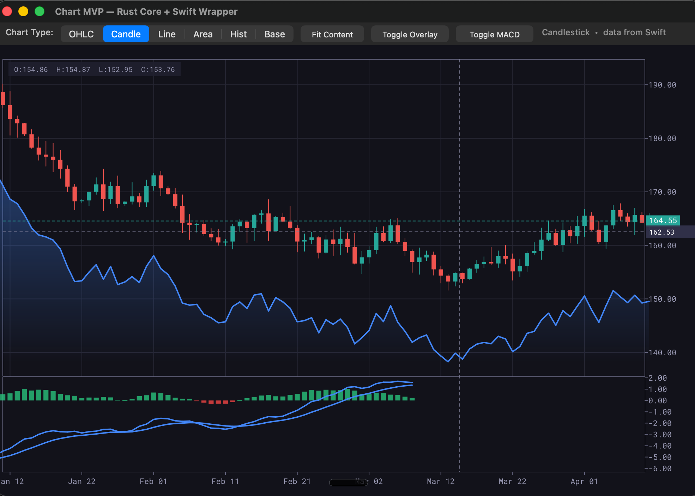
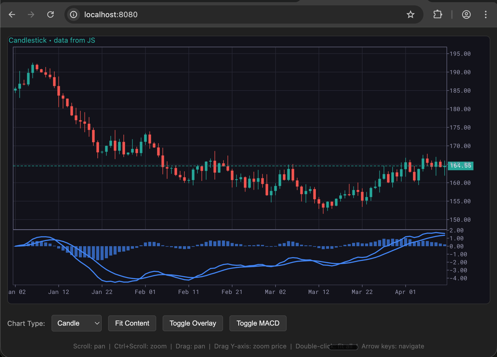

# Lumen Charts

GPU-accelerated charting library built on [Vello](https://github.com/linebender/vello), inspired by [Lightweight Charts](https://github.com/tradingview/lightweight-charts).

The API is designed to stay as close to the original Lightweight Charts API as
possible, making migration straightforward:

- **Swift SDK** — native API for macOS and iOS (via Metal)
- **JavaScript API** — available for the WASM target, requires WebGPU support in
  the browser (Chrome 113+, Safari 18+)
- **WebGL / Canvas** — planned. Note: a Canvas 2D target may not be worthwhile
  since you could use Lightweight Charts natively at that point
- **Windows / Linux** — no high-level SDK yet; use the C-ABI directly
  (see [Platform Support](#platform-support))

### Swift Demo (macOS, Metal)



### WASM Demo (Chrome, WebGPU)



## Project Structure

```
├── core/               Rust core library (rendering, state, C-ABI)
│   ├── src/            Source code
│   ├── include/        C header (chart_core.h)
│   └── target/         Build output (cargo build --release)
├── sdks/
│   ├── swift/          Swift wrapper (LightweightCharts module)
│   └── wasm/           WebAssembly bindings + JS API wrapper
│       ├── src/        wasm-bindgen zero-cost passthrough to C-ABI
│       └── chart_api.js  Lightweight Charts–style JS API
└── examples/
    ├── swift-demo/     macOS demo app (SwiftUI + Metal)
    └── web-demo/       Browser demo (HTML + WebGPU)
```

## Quick Start

### Build the Core Library

```bash
cd core && cargo build --release
```

### Run the Swift Demo

```bash
cd core && cargo build --release
cd ../examples/swift-demo && swift run ChartDemo
```

### Run the WASM / WebGPU Demo

```bash
cd examples/web-demo && ./run.sh
# Opens at http://localhost:8080 (Chrome 113+ or Safari 18+ for WebGPU)
```

The build script compiles the Rust core to WebAssembly via `wasm-pack`, copies the
JS API wrapper into the output `pkg/` directory, and starts a local HTTP server.

### Run Tests

```bash
cd core && cargo test
```

## Architecture

The **core** is a platform-agnostic Rust library that exposes a C-ABI. It handles:
- OHLC, Candlestick, Line, Area, Baseline, Histogram series
- Time scale with zoom, scroll, and fit-to-content
- Price scale with auto-range and percentage mode
- Multi-pane layout with add/remove/reorder
- Crosshair, price lines, and event system
- Invalidation-driven rendering (only redraws when state changes)
- GPU rendering via Vello + wgpu

**SDKs** wrap the C-ABI with idiomatic, type-safe APIs for each platform:
- **Swift SDK** — native Swift classes wrapping the C-ABI, with MetalLayer integration
- **WASM SDK** — `wasm-bindgen` zero-cost passthrough + `chart_api.js` wrapper

**Examples** are runnable demos that showcase the SDK usage.

## JavaScript API (WASM)

The WASM SDK includes `chart_api.js`, a JavaScript wrapper that mirrors the
[Lightweight Charts](https://www.tradingview.com/lightweight-charts/) API:

```javascript
import { createChart } from './pkg/chart_api.js';

const chart = await createChart(document.getElementById('container'));

// Load OHLC data
chart.setData([
    { time: 1704153600, open: 185.0, high: 187.5, low: 184.2, close: 186.3 },
    // ...
]);

// Switch rendering type (data stays the same)
chart.setSeriesType('candlestick');  // 'ohlc' | 'candlestick' | 'line' | 'area' | 'histogram' | 'baseline'

// Add overlay series
const overlay = chart.addAreaSeries({ lineColor: '#2962FF' });
overlay.setData([{ time: 1704153600, value: 186.3 }, /* ... */]);

// Multi-pane support
const macdPane = chart.addPane(0.3);
const histSeries = chart.addHistogramSeries({});
histSeries.moveToPane(macdPane);
histSeries.setData([{ time: 1704153600, value: 0.5 }, /* ... */]);

// Global options
chart.applyOptions({
    layout: { background: { color: '#1f1f1f' }, textColor: '#d1d4dc' },
    grid: { vertLines: { color: '#333' }, horzLines: { color: '#333' } }
});

chart.fitContent();
```

### Data Validation

The JS API validates all input data at the boundary:
- **Throws `TypeError`** on missing required fields (`time`, `open`/`high`/`low`/`close` for OHLC, `value` for line)
- **Warns** when suboptimal data is passed (e.g., OHLC data with extra `value` field)
- **Auto-converts** `close` → `value` for line/area series with a console warning

## Swift Demo Features

Both the Swift and WASM demos support:
- **Chart Type Selector** — OHLC, Candlestick, Line, Area, Histogram, Baseline
- **Fit Content** — auto-zoom to show all data
- **Toggle Overlay** — add/remove an Area series on the main pane
- **Toggle MACD** — add/remove a MACD indicator (histogram + 2 lines) in a separate pane

## Platform Support

The core uses `wgpu` with automatic backend selection (`Backends::all()`). No
configuration is needed — the best GPU API is chosen at runtime:

| Platform       | GPU Backend | Surface Source           | SDK                        |
|----------------|-------------|--------------------------|----------------------------|
| macOS / iOS    | Metal       | `CAMetalLayer`           | ✅ Swift SDK               |
| Browser (WASM) | WebGPU      | `<canvas>` element       | ✅ JavaScript API          |
| Windows        | DX12/Vulkan | `HWND`                   | C-ABI only (no SDK yet)    |
| Linux          | Vulkan      | Wayland/X11 surface      | C-ABI only (no SDK yet)    |
| Android        | Vulkan      | `ANativeWindow`          | C-ABI only (no SDK yet)    |

For platforms without a dedicated SDK (Windows, Linux, Android), you work with
the low-level C-ABI directly via `chart_core.h`. The full C header is at
`core/include/chart_core.h`. All `chart_*` functions are platform-agnostic — only
the initial surface creation call differs per platform.

### Windows (Win32 / HWND)

To embed a chart in a Win32 application, you'd create a `chart_create` variant
that accepts an `HWND`. The core already links against DX12/Vulkan automatically
— only the surface creation entry point needs to be platform-specific:

```c
#include "chart_core.h"
#include <windows.h>

// Hypothetical entry point (not yet implemented):
// Chart* chart_create_win32(HWND hwnd, uint32_t width, uint32_t height, float scale);

LRESULT CALLBACK WndProc(HWND hwnd, UINT msg, WPARAM wp, LPARAM lp) {
    static Chart* chart = NULL;
    switch (msg) {
        case WM_CREATE:
            chart = chart_create_win32(hwnd, 900, 500, 1.0f);
            // Load data, set options...
            break;
        case WM_PAINT:
            chart_render_if_needed(chart);
            break;
        case WM_MOUSEMOVE:
            chart_pointer_move(chart, GET_X_LPARAM(lp), GET_Y_LPARAM(lp));
            break;
    }
    return DefWindowProc(hwnd, msg, wp, lp);
}
```

### Linux (GTK4 + GDK / Wayland)

For GTK4 apps, you'd obtain the native Wayland or X11 surface from GDK and pass
it to a Linux-specific `chart_create` variant:

```c
#include "chart_core.h"
#include <gtk/gtk.h>

// Hypothetical entry point (not yet implemented):
// Chart* chart_create_wayland(void* wl_surface, uint32_t w, uint32_t h, float scale);
// Chart* chart_create_x11(uint32_t window_id, uint32_t w, uint32_t h, float scale);

static void on_realize(GtkWidget *widget, gpointer data) {
    GdkSurface *gdk_surface = gtk_native_get_surface(GTK_NATIVE(widget));

    // For Wayland:
    struct wl_surface *wl = gdk_wayland_surface_get_wl_surface(gdk_surface);
    Chart *chart = chart_create_wayland(wl, 900, 500, 1.0f);

    // All subsequent API calls are the same across all platforms:
    // chart_set_data(chart, data, len);
    // chart_fit_content(chart);
    // chart_pointer_move(chart, x, y);  etc.
}
```

> **Note:** The rendering pipeline (Vello → wgpu → GPU) and the entire C-ABI are
> identical across all platforms. Only the surface creation function differs per
> platform. All `chart_*` functions work the same everywhere once the `Chart*` is
> created.

## License

Apache License 2.0 — see [LICENSE](LICENSE) and [NOTICE](NOTICE).
